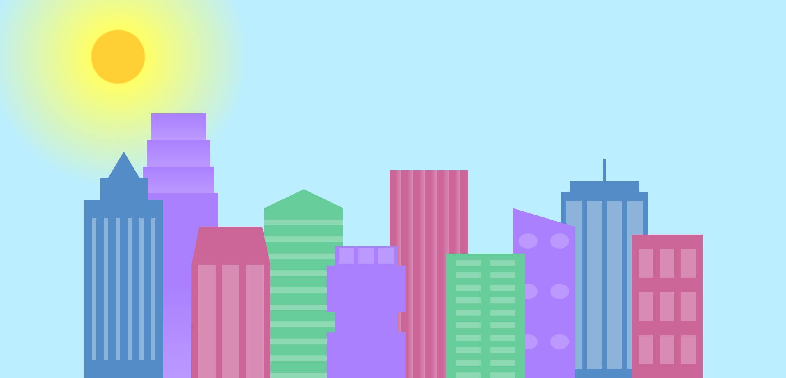
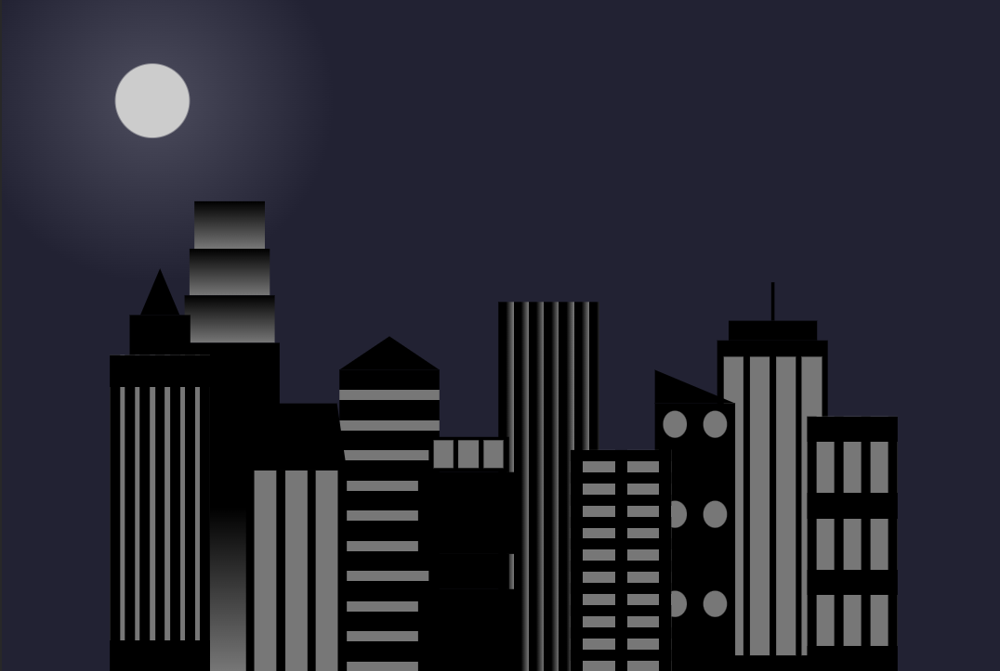
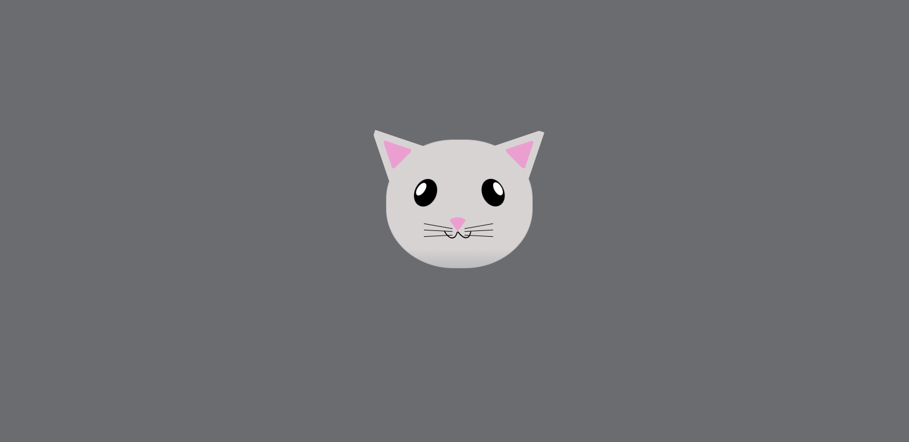
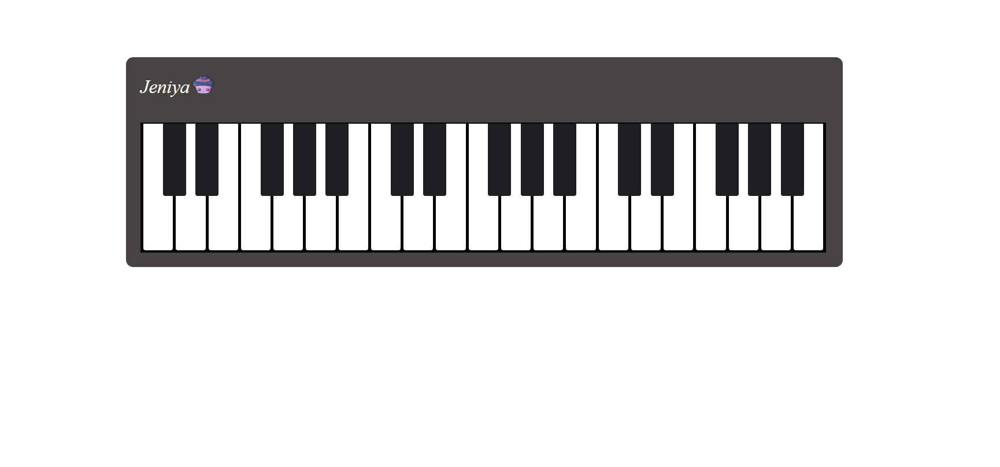

# CSS Designs Repository

This repository contains a collection of CSS designs created over time. The designs range from the most recent ones to older ones, all crafted using CSS.

## Screenshots

### Colorful Day-Night Buildings

**Description:**
This design is a set of colorful buildings under the sun in the day view. In the tab and mobile view, it dynamically transforms into grey and black buildings under the moon at night. This design was inspired by learning experiences on FreeCodeCamp.

**Screenshot:**

**Link:**
[Colorful Day-Night Buildings CSS](https://github.com/Jeniya14/css-design/blob/main/building.html)

### CSS Cat Face

**Description:**
This design is a cat face created entirely using CSS without the use of images.

**Screenshot:**

**Link:**
[CSS Cat Face](https://github.com/Jeniya14/css-design/blob/main/meow.html)

### Simple CSS Piano

**Description:**
This design is a minimalist piano created using CSS without the use of images. This design showcases the ability to replicate real-world objects and instruments with CSS styling, offering a simple yet visually appealing representation of a piano.

**Screenshot:**

**Link:**
[Simple CSS Piano](https://github.com/Jeniya14/css-design/blob/main/piano.html)

## Older Projects

To view my older projects, check out the screenshots folder: [Older Projects Screenshots](screenshots)

